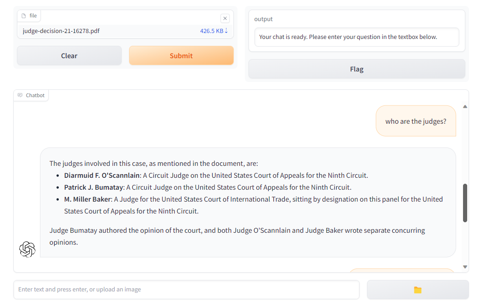
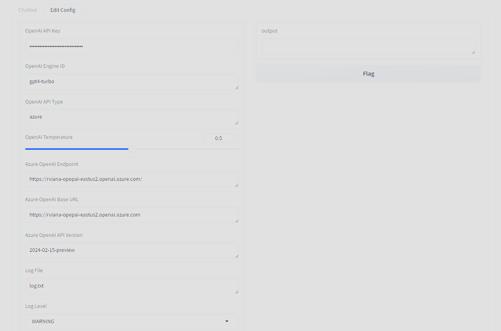

## Use ChatGPT as an ad-hoc bot (OpenAI or Azure) ##

This application works with both OpenAI and Azure OpenAI. The idea is that you can instruct your bot without fine tuning (in OpenAI) or Bring Your Own Data (BYOD) in Azure. It can be a good tool to prototype and as it uses Gradio you can send a link to your application to an external entity (like a friend or a client). Microsoft Azure OpenAI is only available for companies, OpenAI also allow regular people to access its APIs.

I am including a public record random court document PDF that I found by Bing'ing ```"judge decision type:.pdf"```, if somehow I am not supposed to use this public record, let me know and I remove from the repository.


These are some questions I used:

- What is this document about?
- Who are the judges?
- can you make this as a table? (*)
- Can I use this opinion as precedent moving forward?
- With this decision, new restaurant owners can install natural gas?
- What are the options to natural gas?

\*  Note: this was after they gave me the names as text

There are two versions depending of your preference:

- ~~**legalchat.py:** console application already tuned to use the examples I provided~~
- **azure-chat.py** gradio application presenting a more interesting and interactive 

### How to run

1. Create a venv enviroment and install the requirements (you need to be in the app folder)

a) Linux
```bash
python3 -m venv venv/
source ./venv/bin/activate
pip install -r requirements.txt
```
a) Windows
```batch
python3 -m venv venv/
.\venv\Scripts\activate.bat
pip install -r requirements.txt
```


2. Use the configuration tab to add the base urls, secrets and AI parameters

Instructions are the rules for your AI. Don't forget to add \$1 to be replaced by the document. If you don't need to analyze documents, $1 can be removed. Example: *"you are a law scholar and you will respond only questions about the document below or segue questions related to the document: \$1"*
Temperature less the 0.5 will make it less imaginative but more precise, more than 0.7 may lead to "allucinations". I left my endpoints so you will now what to add if you look at your deployments.

3. Run the application (Gradio - web application) from the app folder

a) Linux (on the app folder)

```bash
source ./venv/bin/activate
python azure-chat.py
```

b) Windows
```batch
.\venv\Scripts\activate.bat
python azure-chat.py
```
c) On both plataforms run this to deactivate your virtual environment

```
deactivate
```
4. Use locally or share

You will see on the console an output like this:

```plaitext
Running on local URL:  http://127.0.0.1:7860
Running on public URL: https://c6797e0b15728ad3d5.gradio.live

This share link expires in 72 hours. For free permanent hosting and GPU upgrades, run `gradio deploy` from Terminal to deploy to Spaces (https://huggingface.co/spaces)
```
You can use the local address (http://127.0.0.1:7860) and you can also use and share the public address (the URL is different everytime you run) with your friends

**NOTE:** Do not use server.py. The name is deceiving. It is now there because of a few imports, I will drop it after I migrate all the dependent code.

### Settings

The settings are stored in userconfig.json on the app folder, it looks like this:

```json
{
    "open_ai_api_key": "sk-394kmsadakl24434dslkh3434434",
    "open_ai_engine_id": "gpt-4-turbo-preview",
    "open_ai_api_type": "openai",
    "open_ai_temperature": 0.5,
    "azure_open_ai_endpoint": "",
    "azure_open_ai_base_url": "https://api.openai.com/v1/chat/completions",
    "azure_open_ai_api_version": "2024-02-15-preview",
    "log_file": "log.log",
    "log_level": "WARNING",
    "instruction_message": "You are a AI assistant, please answer questions about this file: $1",
    "welcome_message": "Hello! I'm a chatbot. I can help you with your questions. How can I help you today?",
    "azure_doc_ai_endpoint": "",
    "azure_doc_ai_api_version": "",
    "azure_doc_ai_key": "",
    "open_ai_max_tokens": 800,
    "open_ai_top_p": 0,
    "open_ai_frequency_penalty": 0,
    "open_ai_presence_penalty": 0
}
```

Fortunately you can edit (and create the default file) on the second tab of the application (see image 3). The default values are good for most cases, this is what you need to worry about:

**Important Fields**

JSON Key | Field Name | Why it is important
---|---|---
open_ai_api_key | OpenAI API Key | This is the API key that you need to acquire from Open AI or Microsoft Azure Open AI
open_ai_engine_id | Azure Deployment Name or OpenAI Model | For Azure you name your deployments as you wish and need to use the deployment name. For Open AI it is the name of your model (eg. gpt-3.5-turbo, gpt-4-turbo)
open_ai_api_type | OpenAI API Type | You may use only these two self-explanatory options 'azure' or 'openai'
open_ai_temperature | OpenAI Temperature | Close to 0 is more precise, close to 1 is more creative. Use 0.5 if in doubt for a balanced response
azure_open_ai_endpoint | Azure/OpenAI Endpoint | For future use, leave blank
azure_open_ai_base_url | Azure/OpenAI Base URL | For OpenAI is always https://api.openai.com/v1/chat/completions, for Azure is the endpoint of your service (you can see in Resource Management | Keys and Endpoint) 
azure_open_ai_api_version | Azure OpenAI API Version | The API revision, you can use '2024-02-15-preview' for now
log_file | Log File | The name of the log file (default is log.log)
log_level | Log Level | Choices are "DEBUG", "INFO", "WARNING", "ERROR", and "CRITICAL". Use WARNING or HIGHER if you do not want to create a huge file
instruction_message | Instruction Message | This is one of the most important configuration. The rules you create for your bot. If you add \$1, this will be replaced by the file you updated. Example: *"You are a legal scholar and you will answer only questions related to the document below or segue questions related to the document. The document is: \$1"*, notice the \$1 in the instructions, this is where you will use your own data. You can upload PDF and DOCX files.
azure_doc_ai_endpoint, azure_doc_ai_endpoint, azure_doc_ai_api_version, azure_doc_ai_key | Document AI | Not implemented yet. For Azure clients with Document Intelligence services
open_ai_max_tokens | OpenAI Max Tokens | The number maximum of tokens you want for your reponse. Too high may increase response time and API usage (money). If you put a number too low you may see an error if the response requires more token. Use at least 800.
open_ai_top_p | OpenAI Top P | It is almost the same as OpenAI temperature. Use only temperature. See documentation


**Screenshots:**





